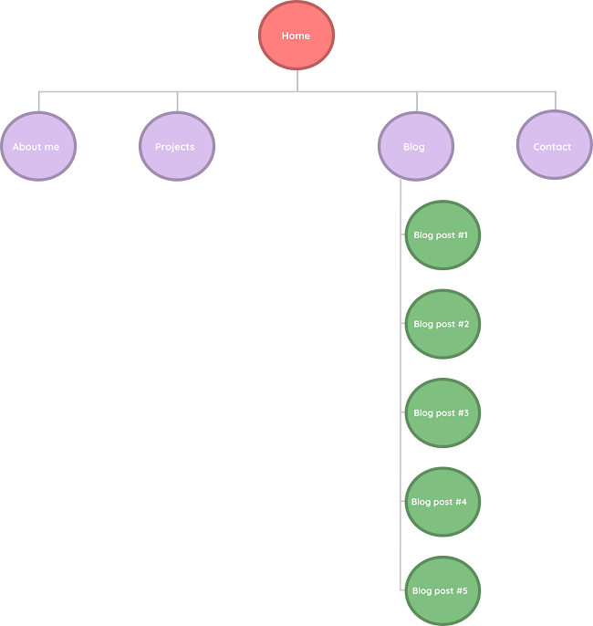
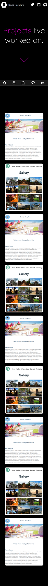
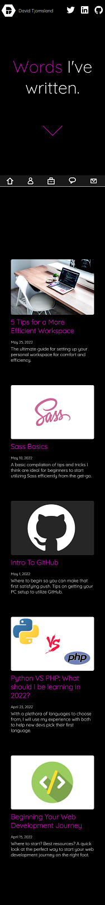

# T1A2 - Portfolio
URL: https://davidtjomsland.netlify.app/ | GitHub repo: https://github.com/DTjomsland/T1A2
## Contents

- [Purpose](#purpose)
- [Functionality/Features](#functionality)
- [Sitemap](#sitemap)
- [Screenshots](#screenshots)
- [Target Audience](#targetaudience)
- [Tech Stack](#techstack)

## [Purpose](#purpose)
- Create a hub where users can get to know about me, my past projects, and work experience.
- Promote my work to prospective employers.
- Showcase my skills to other developers.
- Share ideas and lessons that I have learned throughout my career through my blog.

## [Functionality and Features](#functionality)
---
### Functionality
The design of this website is intended to be stylish, while also being easy to navigate on all devices. This being so, responsiveness was of the upmost importance throughout the entire design and coding process. The colors were chosen to be both fun and exciting, while also being accessible to all users. The design relies heavily on animations to bring the website to life and engage users throughout.
### Features 
The purpose of this website is to showcase my work, inform the user about me, teach the user about web development, and give them a way to contact me if interested.  The features of this website reflect that with entire pages dedicated to each of these purposes. The About Me page contains both professional and fun personal information about me so the user can get an idea of who I am as a person. This is done through the use of cards displaying my professional background and links to my spotify playlists/books that I am reading. My projects page is used to showcase my work.  This page contains cards that provide a glimpse of the projects as well as links to the projects. My blog page is used to teach others about web development.  It does this by providing links to articles that I have written about topics that are important to new developers. Lastly, my contact page provides the user with information on how to contact me as well as a form to directly email me if they choose.
## [Sitemap](#sitemap)
---

## [Screenshots](#screenshots)
---
### Desktop - Home

### Mobile - Home

### Desktop - About Me 

### Mobile - About Me 

### Desktop - Projects 

### Mobile - Projects 

### Desktop - Blog 

### Mobile - Blog 

### Desktop - Blog Post

### Mobile - Blog Post

### Desktop - Contact

### Mobile - Contact

[Target Audience](#targetaudience)
---
The target audience is potential employers and those looking for ideas and information about web development.
## [Tech Stack](#techstack)
---
The tech stack used for this project consist of HTML and SCSS.